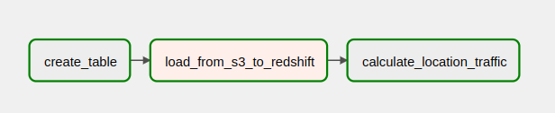
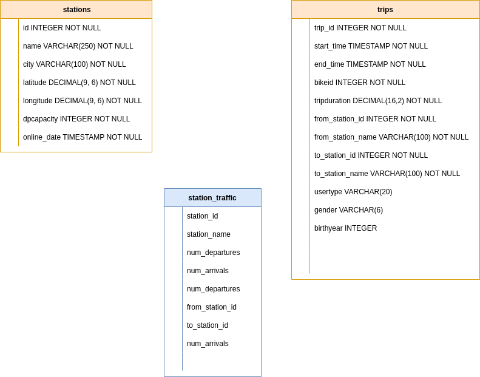
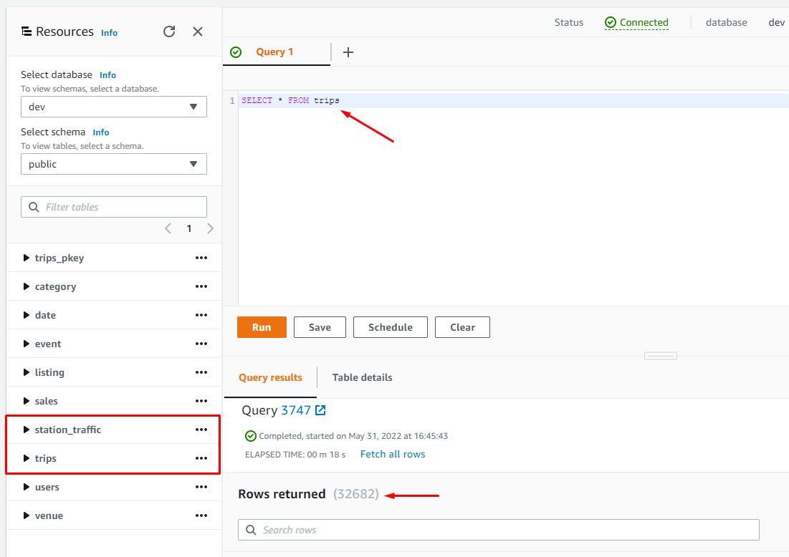

# S3 to Redshift
This project aims to build an ETL for bike share company to identify our most highly traffic locations. What´s build an Airflow DAG that allows us to peform this analysis. Before we begin, we need to follow thesee steps below:

## How to Run (Step-by-Step)
* Open IAM.pdf and Create and IAM User in AWS
* Open Redshift.pdf and Create an AWS Redshift Cluster
* Go to the project folder and initialize the docker containers
    * Setting the right Airflow user
     ```
        mkdir -p ./logs ./plugins
        echo -e "AIRFLOW_UID=$(id -u)" > .env
    ```
    * open the terminal and Initialize the database
     ```
        docker-compose up airflow-init
    ```
    * open another the terminal and run airflow
     ```
        docker-compose up
    ```    

*   Open Airflow-AWS.pdf and connect Airflow to AWS
*   Open Airflow-Redshift.pdf and connect Airflow to AWS Redshift
*   In Airflow-Web go to s3_to_redshift dag unpaused dag and trigger dag
The data modeling chosen was the star schema. Among the main advantages we can mention: good response time, script run time, flexibility in the model, low complexity in the model.


## Airflow DAG



## Redshift Schema

 
 
## Checking Redshift

